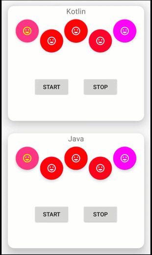

## FabAnimator 
[](https://jitpack.io/#okabbas/FabAnimator)
[]()

This library is for adding smooth animation and animators to the FloatingActionButton library android.





## Getting Started
Add to your root build.gradle:
```Groovy
allprojects {
	repositories {
	    maven { url "https://jitpack.io" }
      ...
	}
}
```

Add the dependency:
```Groovy
dependencies {
    compile 'com.github.okabbas:FabAnimator:0.9.2'
    //or 
    implementation 'com.github.okabbas:FabAnimator:0.9.2'
}
```

## Simple API

##### Code sample for Kotlin language programmers:
```Groovy
//Create an instance of the AnimatorObject class and inject FAB into it.
val animatorObject = AnimatorObject(fab_1)

//To start animations by default
animatorObject.createAnimator()

//To stop animations by default
animatorObject.stopAnimator()

//So easy :) I love Kotlin :)
```

##### Code sample for Java language programmers:
```Groovy
//Create an instance of the AnimatorObject class and inject FAB into it.
AnimatorObject animatorObject = new AnimatorObject(fab_1);

//To start animations by default
AnimatorObject.createAnimator(ColorModel.Background,
 AnimModel.None, 300, new int[]{Color.MAGENTA, Color.RED});

//To stop animations by default
AnimatorObject.stopAnimator(ColorModel.Background, Color.BLACK);

```

## Licence
```Groovy
Copyright (c) 2018 Abbas Naghdi

Permission is hereby granted, free of charge, to any person obtaining a copy
of this software and associated documentation files (the "Software"), to deal
in the Software without restriction, including without limitation the rights
to use, copy, modify, merge, publish, distribute, sublicense, and/or sell
copies of the Software, and to permit persons to whom the Software is
furnished to do so, subject to the following conditions:

The above copyright notice and this permission notice shall be included in all
copies or substantial portions of the Software.

THE SOFTWARE IS PROVIDED "AS IS", WITHOUT WARRANTY OF ANY KIND, EXPRESS OR
IMPLIED, INCLUDING BUT NOT LIMITED TO THE WARRANTIES OF MERCHANTABILITY,
FITNESS FOR A PARTICULAR PURPOSE AND NONINFRINGEMENT. IN NO EVENT SHALL THE
AUTHORS OR COPYRIGHT HOLDERS BE LIABLE FOR ANY CLAIM, DAMAGES OR OTHER
LIABILITY, WHETHER IN AN ACTION OF CONTRACT, TORT OR OTHERWISE, ARISING FROM,
OUT OF OR IN CONNECTION WITH THE SOFTWARE OR THE USE OR OTHER DEALINGS IN THE
SOFTWARE.
```

