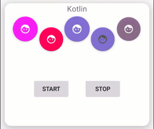

## FabAnimator 
[](https://jitpack.io/#okabbas/FabAnimator)
[](https://github.com/okabbas/FabAnimator)
[](https://github.com/okabbas/FabAnimator)

This library is for adding smooth animation and animators to the FloatingActionButton library android.


 


## Getting Started :
Add to your root build.gradle :
```Groovy
allprojects {
  repositories {
      maven { url 'https://jitpack.io' } // add this line to repositories 
    }
  }
```

Add the dependency : 
```Groovy
dependencies {
    implementation 'com.github.okabbas:FabAnimator:1.0.2'
}
```

## Simple API (default) :

##### In `Kotlin`:
```Groovy
val animatorObject1 = AnimatorObject()
 
//for config and start
animatorObject1.create(fab_1)
        .setColoring() // if needed & optional
        .setAnimation() // if needed & optional
        .start()
 
//for stop
animatorObject1.stopColoring() //optional
        .stopAnimation() // if needed & optional
        .stopColoring() // if needed & optional
 
//So easy :) I love Kotlin :)

```

##### In `Java` :
```Groovy
AnimatorObject animatorObject1 = new AnimatorObject();
 
//for config and start
animatorObject1.create(fab_1)
        .setColoring(ColorModel.BG, 1500, new int[]{Color.BLACK, Color.LTGRAY, Color.MAGENTA})
        .setAnimation(AnimModel.SHAKE, 800)
        .start();
 
//for stop
animatorObject1.stopColoring(ColorModel.BG, Color.MAGENTA)
        .stopAnimation()
        .stopColoring();
```

## Advanced API :

##### In `Kotlin`:
###### [Sample code written with Katlin](Sample/src/main/java/com/github/okabbas/FabAnimator/Sample/KotlinView.kt).

##### In `Java`:
###### [Sample code written with Java](Sample/src/main/java/com/github/okabbas/FabAnimator/Sample/JavaView.java).

## License
    MIT License

    Copyright (c) 2018 Abbas Naghdi

    Permission is hereby granted, free of charge, to any person obtaining a copy
    of this software and associated documentation files (the "Software"), to deal
    in the Software without restriction, including without limitation the rights
    to use, copy, modify, merge, publish, distribute, sublicense, and/or sell
    copies of the Software, and to permit persons to whom the Software is
    furnished to do so, subject to the following conditions:

    The above copyright notice and this permission notice shall be included in all
    copies or substantial portions of the Software.

    THE SOFTWARE IS PROVIDED "AS IS", WITHOUT WARRANTY OF ANY KIND, EXPRESS OR
    IMPLIED, INCLUDING BUT NOT LIMITED TO THE WARRANTIES OF MERCHANTABILITY,
    FITNESS FOR A PARTICULAR PURPOSE AND NONINFRINGEMENT. IN NO EVENT SHALL THE
    AUTHORS OR COPYRIGHT HOLDERS BE LIABLE FOR ANY CLAIM, DAMAGES OR OTHER
    LIABILITY, WHETHER IN AN ACTION OF CONTRACT, TORT OR OTHERWISE, ARISING FROM,
    OUT OF OR IN CONNECTION WITH THE SOFTWARE OR THE USE OR OTHER DEALINGS IN THE
    SOFTWARE.

